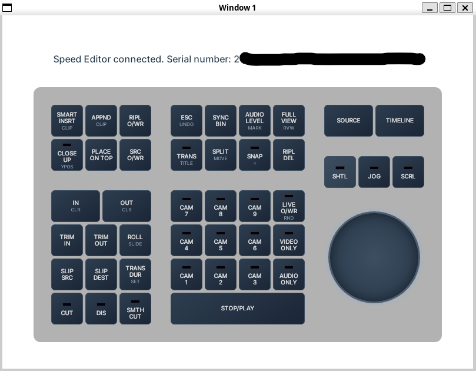

# speed-editor-rebind
Cross platform GUI for rebinding DaVinci Resolve Speed Editor keys

*WORK IN PROGRESS* - I'll remove this notice when a V1 release is available



## Dev notes

Fedora deps for wails3:

```sudo dnf install gtk3-devel webkit2gtk4.1-devel pkgconf gcc```

Generate keyboard layout:

```
go run cmd/generate-layout/main.go > frontend/partials/keyboard.html
```
(copy into index.html)

Install wails3 CLI:

```
go install github.com/wailsapp/wails/v3/cmd/wails3@latest
```

#### SA_ONSTACK errors

While developing I have run into SA_ONSTACK errors a couple of times. Looks like these are usually nil pointer dereferences, but something weird is happening with Wails:
     1. Nil dereference → SIGSEGV (signal 11)
     2. Go's tries to handle the signal on a signal stack
     3. WebKit/GTK (from Wails) has already installed its own signal handler for signal 11 without the `SA_ONSTACK` flag
     4. Go crashes with: non-Go code set up signal handler without SA_ONSTACK flag
